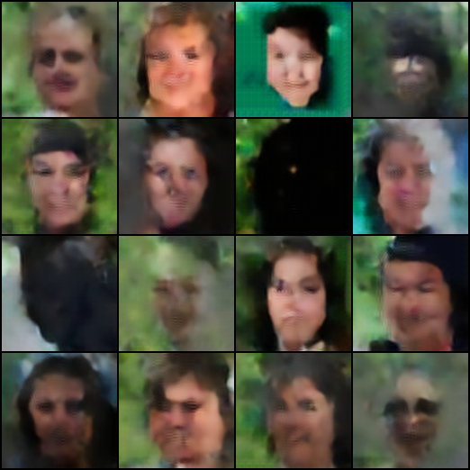

# Wavelet-AR: Multiscale Autoregressive Image Modeling using Wavelet-VQVAE

This project explores a multiscale generative modeling approach combining discrete wavelet transforms (DWT), VQ-VAE quantization for each frequency band, and a Transformer for autoregressive synthesis.



---

## 📌 Project Overview

Traditional generative models often struggle with maintaining fidelity at coarse scales. We propose a hybrid method that:

- Decomposes images into wavelet subbands (LL, LH, HL, HH),
- Trains a VQ-VAE on each subband for discrete latent representations,
- Uses a Transformer to autoregressively model the sequence of discrete codes.

This results in faster training and multiresolution image generation capabilities.

---

## 🛠️ Setup

### 1. Install Dependencies

```bash
pip install -r requirements.txt
```

---

## 🧪 Reproducing Results

### Step 1: Train the Wavelet VQ-VAE

```bash
python train_vqvae.py
```

- Trains VQ-VAEs for each wavelet band using FFHQ-256
- Saves the checkpoint to `wavelet_vqvae.pth`

### Step 2: Train the Transformer

```bash
python transformer.py
```

- Loads the VQ-VAE checkpoint
- Autoregressively models the wavelet-index sequences
- Saves model to `wavelet_transformer.pth`
- Saves generated samples to `generated_samples.png`

---

## 📊 Logging

TensorBoard logs are saved to:
```
runs/wavelet_transformer/
```

Launch with:

```bash
tensorboard --logdir=runs
```

---

## 📁 Directory Structure

```
.
├── vqvae.py                 # Wavelet VQ-VAE model
├── train_vqvae.py           # Train script for VQ-VAE
├── wavelet_transformer.py   # Autoregressive Transformer
├── train_transformer.py     # Train script for Transformer
├── generated_samples.png    # Output samples
├── requirements.txt         # Python dependencies
├── README.md
```

---

## 📦 Dataset

- [FFHQ-256](https://huggingface.co/datasets/merkol/ffhq-256) (via 🤗 datasets)

This is automatically downloaded using:

```python
load_dataset("merkol/ffhq-256", split="train")
```

---

## 🤝 Authors

- Vikram Bhagavatula
- Ritvika Sonawane
- Siddharth Shah

Department of Electrical and Computer Engineering  
Carnegie Mellon University

---
